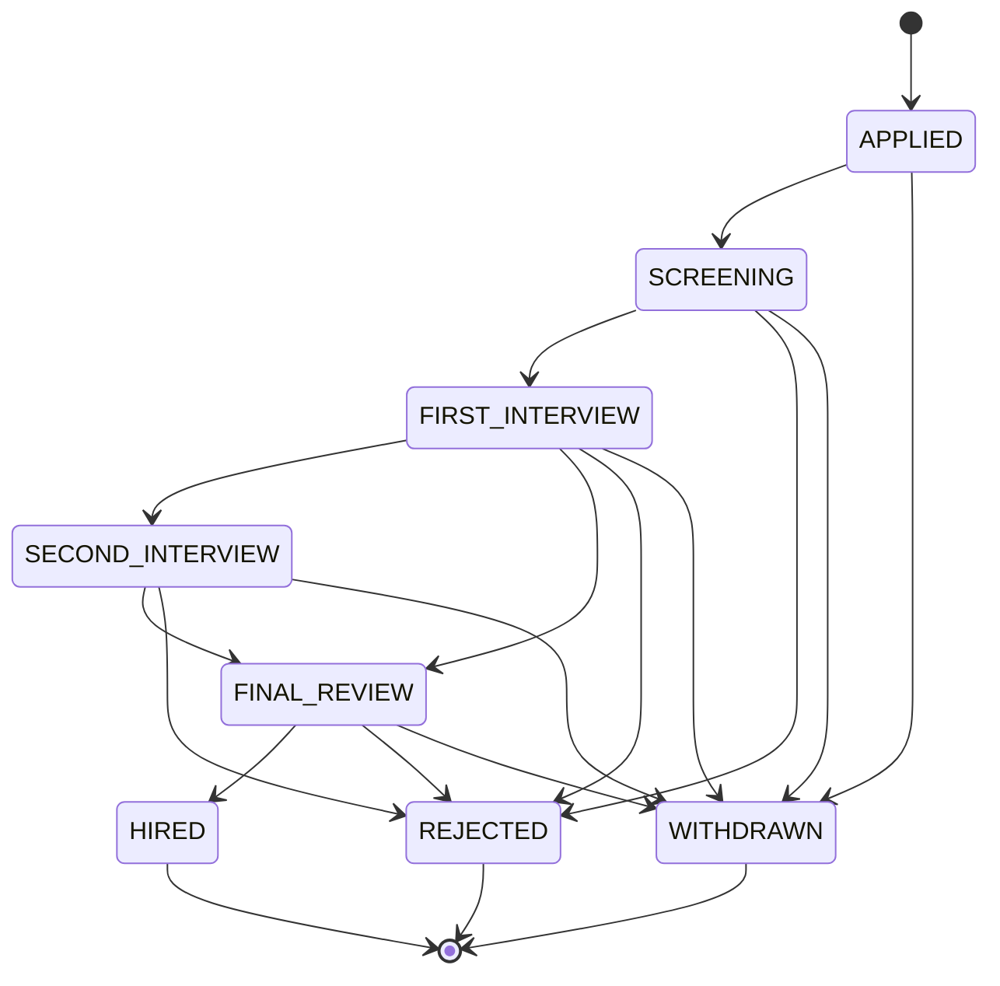
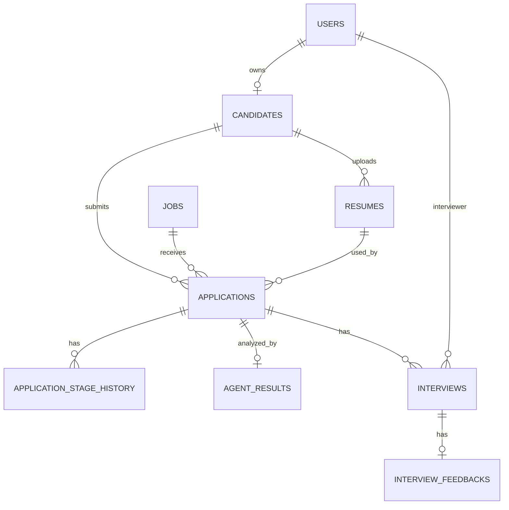

# HR 招聘系统 MVP 设计方案

> 版本：MVP V1  
> 目标：用最小功能完成一个可真实使用的招聘闭环。  
> 技术栈：React + FastAPI + PostgreSQL + Redis + Celery + MinIO  
> 核心原则：**先把招聘主流程跑通，其余功能全部延后。**

---

# 1. MVP 要解决什么

第一版只解决下面这一条流程：

```text
HR 创建岗位
    ↓
发布岗位
    ↓
求职者查看岗位
    ↓
注册 / 登录
    ↓
上传简历
    ↓
投递岗位
    ↓
AI 解析简历并进行岗位匹配评分
    ↓
HR 查看候选人并筛选
    ↓
安排面试
    ↓
邮件发送面试信息
    ↓
面试官填写面评
    ↓
HR 给出最终结果
    ↓
求职者查看申请进度
```

只要这条链完整跑通，就认为 MVP 完成。

---

# 2. 暂时不做的功能

以下功能全部放到 V2 或 V3：

- Dashboard 数据大屏
- 招聘漏斗分析
- 招聘渠道分析
- 人才库
- 候选人标签
- 多租户
- 企业微信 / 钉钉
- 日历同步
- AI 视频面试
- 自动邀约
- Offer PDF 管理
- Offer 电子签
- 招聘流程模板
- 自定义招聘阶段
- 自定义 AI 权重
- Prompt 管理后台
- Agent 模型配置后台
- 邮件模板管理后台
- 复杂组织架构
- 部门树
- 完整操作审计页面
- 批量导入导出
- Excel 导出
- 高级搜索
- 多语言
- 短信
- 手机验证码登录

---

# 3. 系统角色

MVP 只保留四类用户：

```text
求职者 Candidate
HR
面试官 Interviewer
超级管理员 Super Admin
```

---

# 4. 求职者端功能

---

## 4.1 岗位列表

支持：

- 查看招聘中的岗位
- 按关键词搜索
- 查看岗位详情

岗位详情只保留：

```text
岗位名称
工作地点
岗位职责
任职要求
发布时间
```

MVP 不做：

- 多维高级筛选
- 岗位收藏
- 岗位推荐
- 分享
- 招聘频道分类

---

## 4.2 注册与登录

第一版只支持：

```text
邮箱 + 密码注册
邮箱 + 密码登录
```

后续再增加：

- 邮箱验证码登录
- 手机登录
- OAuth 登录

---

## 4.3 简历上传

支持：

```text
PDF
DOCX
```

每个求职者第一版只需要维护一个当前简历。

流程：

```text
上传简历
    ↓
存入 MinIO
    ↓
Celery 创建解析任务
    ↓
AI / Parser 提取结构化信息
    ↓
保存 PostgreSQL
```

解析字段先控制为：

```text
姓名
邮箱
手机号

教育经历
工作经历
项目经历
技能
```

暂时不做：

- 多版本简历
- 默认简历切换
- 在线简历编辑器
- 简历模板
- 简历导出

---

## 4.4 岗位投递

候选人点击：

```text
立即申请
```

系统创建：

```text
Application
```

记录：

```text
candidate
job
resume
current_stage
status
applied_at
```

同一个求职者同一个岗位只能存在一个有效申请。

---

## 4.5 我的申请

显示：

```text
岗位名称
投递时间
当前进度
```

详情显示：

```text
已投递
    ↓
简历审核
    ↓
一面
    ↓
二面 / HR面
    ↓
最终结果
```

第一版不显示：

- AI 分数
- HR 内部备注
- 面试官评分
- 内部淘汰原因

---

## 4.6 面试信息

求职者可以看到：

```text
面试岗位
面试时间
面试方式
面试链接
```

---

# 5. HR 管理端功能

---

## 5.1 岗位管理

HR 可以：

```text
创建岗位
编辑岗位
发布岗位
关闭岗位
查看岗位候选人
```

字段：

```text
岗位名称
工作地点
岗位职责
任职要求
岗位状态
```

岗位状态：

```text
DRAFT
PUBLISHED
CLOSED
```

第一版不做：

- 暂停岗位
- 岗位复制
- 招聘人数统计
- 招聘负责人多人协作
- 岗位流程模板
- AI 权重配置

---

# 5.2 候选人列表

HR 可以查看：

```text
姓名
岗位
投递时间
当前阶段
AI 分数
```

支持最基础筛选：

```text
岗位
招聘阶段
```

暂时不做复杂筛选。

---

# 5.3 候选人详情

这是 MVP 后台最重要的页面。

显示：

```text
候选人基本资料

原始简历

结构化简历

AI 匹配结果

当前招聘阶段

面试记录

面试评价
```

HR 可操作：

```text
通过
拒绝
安排面试
进入下一阶段
```

---

# 6. HR Agent

MVP 只做两个 Agent 功能。

---

## 6.1 简历解析

输入：

```text
PDF / DOCX
```

输出：

```json
{
  "name": "",
  "email": "",
  "phone": "",
  "education": [],
  "work_experience": [],
  "projects": [],
  "skills": []
}
```

---

## 6.2 岗位匹配评分

输入：

```text
岗位 JD
+
结构化简历
```

输出：

```json
{
  "score": 82,
  "summary": "整体较匹配",
  "strengths": [
    "Python 开发经验符合要求",
    "具有相关项目经验"
  ],
  "gaps": [
    "缺少 Kubernetes 经验"
  ],
  "recommendation": "RECOMMEND"
}
```

MVP 不做：

- JD Parser 独立 Agent
- 多 Agent 协作
- 自定义评分维度
- 自定义权重
- Agent Prompt 管理后台
- Agent 模型管理后台
- Token 统计页面
- Agent 版本管理页面
- 自动淘汰候选人

AI 只提供：

```text
分数
+
简短评价
+
优势
+
不足
```

最终是否通过仍由 HR 决定。

---

# 7. 招聘流程

MVP 不做“可配置招聘流程”。

第一版直接固定：

```text
APPLIED
    ↓
SCREENING
    ↓
FIRST_INTERVIEW
    ↓
SECOND_INTERVIEW
    ↓
FINAL_REVIEW
    ↓
HIRED
```

任何招聘中的阶段都可以进入：

```text
REJECTED
WITHDRAWN
```

如果公司暂时只需要一次技术面，也可以直接：

```text
APPLIED
→ SCREENING
→ FIRST_INTERVIEW
→ FINAL_REVIEW
→ HIRED
```

---

# 8. 招聘状态机



---

# 9. 求职者状态映射

内部状态：

```text
APPLIED
SCREENING
FIRST_INTERVIEW
SECOND_INTERVIEW
FINAL_REVIEW
HIRED
REJECTED
WITHDRAWN
```

求职者看到：

| 内部状态 | 求职者显示 |
|---|---|
| APPLIED | 已投递 |
| SCREENING | 简历审核中 |
| FIRST_INTERVIEW | 一面 |
| SECOND_INTERVIEW | 二面 |
| FINAL_REVIEW | 结果确认中 |
| HIRED | 已通过 |
| REJECTED | 招聘流程已结束 |
| WITHDRAWN | 已撤回 |

---

# 10. 面试管理

HR 创建面试：

```text
候选人
面试官
时间
面试方式
面试链接
备注
```

状态只保留：

```text
SCHEDULED
COMPLETED
CANCELLED
```

第一版不做复杂改期流程。

需要改时间时，HR 直接编辑 Interview。

---

# 11. 邮件

MVP 只发送两种邮件：

```text
投递成功
面试邀请
```

如果开发时间允许，再增加：

```text
面试取消
最终结果通知
```

邮件内容第一版直接使用后端模板，不做模板管理后台。

---

# 12. 面试官功能

面试官登录后只需要两个页面：

```text
我的面试
面试详情
```

可以查看：

```text
候选人姓名
简历
岗位 JD
面试时间
```

填写：

```text
专业能力：1-5
项目经验：1-5
沟通能力：1-5

优势
不足
总结

结论：
PASS
HOLD
FAIL
```

MVP 不做：

- 自定义评分卡
- 不同岗位不同 Scorecard
- 多面试官汇总算法
- 面评修改审批

---

# 13. 超级管理员

超级管理员 MVP 只负责：

```text
创建后台用户

修改后台用户

给用户分配角色

禁用用户
```

不做完整的动态 Permission 管理后台。

角色权限暂时由后端代码固定。

---

# 14. 简化 RBAC 权限矩阵

| 功能 | 超级管理员 | HR | 面试官 | 求职者 |
|---|---|---|---|---|
| 管理后台用户 | √ | × | × | × |
| 创建/修改岗位 | √ | √ | × | × |
| 发布/关闭岗位 | √ | √ | × | × |
| 查看全部申请 | √ | √ | × | × |
| 查看指定候选人 | √ | √ | 已分配 | 自己 |
| 查看简历 | √ | √ | 已分配 | 自己 |
| 查看 AI 评分 | √ | √ | × | × |
| 修改招聘阶段 | √ | √ | × | × |
| 拒绝候选人 | √ | √ | × | × |
| 创建面试 | √ | √ | × | × |
| 查看面试 | √ | √ | 自己 | 自己 |
| 填写面评 | √ | √ | √ | × |
| 查看面评 | √ | √ | 自己 | × |
| 上传简历 | × | × | × | √ |
| 投递岗位 | × | × | × | √ |
| 查看申请进度 | √ | √ | × | √ |

---

# 15. 数据库 ER 设计

核心表：

```text
users
candidates
jobs
resumes
applications
application_stage_history
agent_results
interviews
interview_feedbacks
```

共 9 张核心业务表。

---

# 15.1 ER 图



---

# 15.2 users

```text
id UUID PK

email VARCHAR UNIQUE
password_hash VARCHAR

role VARCHAR

name VARCHAR
status VARCHAR

created_at
updated_at
```

role：

```text
SUPER_ADMIN
HR
INTERVIEWER
CANDIDATE
```

MVP 暂时不拆：

```text
roles
permissions
user_roles
role_permissions
```

后续需要复杂 RBAC 时再拆。

---

# 15.3 candidates

```text
id UUID PK

user_id FK users

name VARCHAR
phone VARCHAR
city VARCHAR

created_at
updated_at
```

---

# 15.4 resumes

```text
id UUID PK

candidate_id FK candidates

file_name VARCHAR
storage_key VARCHAR

parse_status VARCHAR

parsed_data JSONB

created_at
updated_at
```

---

# 15.5 jobs

```text
id UUID PK

title VARCHAR
location VARCHAR

description TEXT
requirements TEXT

status VARCHAR

created_by FK users

published_at DATETIME NULL

created_at
updated_at
```

---

# 15.6 applications

整个系统最核心的表。

```text
id UUID PK

candidate_id FK candidates
job_id FK jobs
resume_id FK resumes

current_stage VARCHAR
status VARCHAR

ai_score DECIMAL NULL

applied_at DATETIME

created_at
updated_at
```

status：

```text
ACTIVE
HIRED
REJECTED
WITHDRAWN
```

---

# 15.7 application_stage_history

```text
id UUID PK

application_id FK applications

from_stage VARCHAR
to_stage VARCHAR

changed_by FK users NULL

reason TEXT NULL

created_at
```

每次阶段变化必须新增一条记录。

---

# 15.8 agent_results

MVP 不拆 Agent Run 与 Agent Result。

直接：

```text
id UUID PK

application_id FK applications UNIQUE

score DECIMAL

summary TEXT

strengths JSONB
gaps JSONB

recommendation VARCHAR

raw_result JSONB

status VARCHAR
error_message TEXT NULL

created_at
updated_at
```

后续需要多次重跑和版本追踪时，再拆：

```text
agent_runs
agent_results
```

---

# 15.9 interviews

MVP 一个 Interview 对应一个主要面试官。

```text
id UUID PK

application_id FK applications
interviewer_id FK users

round_type VARCHAR

scheduled_at DATETIME
duration_minutes INT

method VARCHAR
meeting_url VARCHAR

status VARCHAR

note TEXT

created_by FK users

created_at
updated_at
```

round_type：

```text
FIRST
SECOND
HR
```

---

# 15.10 interview_feedbacks

```text
id UUID PK

interview_id FK interviews UNIQUE

interviewer_id FK users

professional_score INT
project_score INT
communication_score INT

strengths TEXT
weaknesses TEXT
summary TEXT

recommendation VARCHAR

created_at
updated_at
```

---

# 16. MVP API

API 统一：

```text
/api/v1
```

---

## 16.1 Auth

```http
POST /auth/register
POST /auth/login
GET  /auth/me
```

---

## 16.2 求职者

```http
GET  /candidate/profile
PUT  /candidate/profile

POST /candidate/resume
GET  /candidate/resume
```

---

## 16.3 公开岗位

```http
GET /jobs
GET /jobs/{id}
```

---

## 16.4 投递

```http
POST /applications
GET  /applications/my
GET  /applications/{id}
POST /applications/{id}/withdraw
```

---

## 16.5 管理后台岗位

```http
POST /admin/jobs
GET  /admin/jobs
GET  /admin/jobs/{id}
PUT  /admin/jobs/{id}

POST /admin/jobs/{id}/publish
POST /admin/jobs/{id}/close
```

---

## 16.6 管理后台候选人

```http
GET /admin/applications
GET /admin/applications/{id}

POST /admin/applications/{id}/next-stage
POST /admin/applications/{id}/reject
```

---

## 16.7 Agent

```http
GET  /admin/applications/{id}/agent-result
POST /admin/applications/{id}/agent-rerun
```

候选人投递后默认自动执行 AI 分析。

---

## 16.8 面试

HR：

```http
POST /admin/interviews
GET  /admin/interviews
PUT  /admin/interviews/{id}
POST /admin/interviews/{id}/cancel
```

面试官：

```http
GET  /interviewer/interviews
GET  /interviewer/interviews/{id}

POST /interviewer/interviews/{id}/feedback
```

---

# 17. 页面数量控制

---

## 17.1 求职者端

只需要：

```text
1. 首页 / 岗位列表
2. 岗位详情
3. 登录
4. 注册
5. 我的简历
6. 我的申请
7. 申请详情
```

约 7 个核心页面。

---

## 17.2 管理端

只需要：

```text
1. 登录
2. 岗位列表
3. 岗位编辑
4. 候选人列表
5. 候选人详情
6. 面试列表
7. 面试详情
8. 后台用户管理
```

约 8 个核心页面。

---

## 17.3 面试官

实际上直接复用管理端 Layout。

只开放：

```text
我的面试
面试详情
```

不用单独开发第三套前端。

因此整个项目依然只有：

```text
candidate-web
admin-web
```

两套前端。

---

# 18. 项目目录

```text
hr-system/

├── frontend/
│   ├── candidate-web/
│   └── admin-web/
│
├── backend/
│   └── app/
│       ├── main.py
│       │
│       ├── core/
│       │   ├── config.py
│       │   ├── database.py
│       │   ├── security.py
│       │   └── permissions.py
│       │
│       ├── modules/
│       │   ├── auth/
│       │   ├── candidates/
│       │   ├── resumes/
│       │   ├── jobs/
│       │   ├── applications/
│       │   ├── agents/
│       │   ├── interviews/
│       │   └── users/
│       │
│       └── workers/
│           ├── celery_app.py
│           ├── resume_tasks.py
│           ├── agent_tasks.py
│           └── email_tasks.py
│
├── deploy/
│
└── docker-compose.yml
```

---

# 19. Docker 服务

MVP：

```text
backend
celery-worker
postgres
redis
minio
nginx
```

前端生产构建后可以由 Nginx 提供静态资源。

---

# 20. 开发顺序

建议严格按照以下顺序开发。

---

## 阶段 1：基础框架

实现：

```text
FastAPI
PostgreSQL
React
登录
固定角色权限
```

验收：

```text
HR / 面试官 / 求职者可以登录
```

---

## 阶段 2：岗位

实现：

```text
HR 创建岗位
HR 发布岗位
求职者查看岗位
```

验收：

```text
后台发布的岗位可以在求职者端看到
```

---

## 阶段 3：简历 + 投递

实现：

```text
上传简历
MinIO
Application
我的申请
```

验收：

```text
求职者可以成功投递岗位
```

---

## 阶段 4：AI

实现：

```text
简历解析
岗位匹配
AI 分数
优势
不足
```

验收：

```text
投递后 HR 可以看到 AI 分析结果
```

---

## 阶段 5：HR 筛选

实现：

```text
候选人列表
候选人详情
通过
拒绝
状态历史
```

验收：

```text
HR 可以完整处理简历筛选
```

---

## 阶段 6：面试

实现：

```text
创建面试
指定面试官
发送邮件
面试官查看
填写面评
```

验收：

```text
真实完成一次面试
```

---

## 阶段 7：最终结果

实现：

```text
HIRED
REJECTED
WITHDRAWN
```

候选人端同步显示最终状态。

至此 MVP 完成。

---

# 21. MVP 最终功能范围

## 求职者

```text
注册登录
查看岗位
上传简历
投递岗位
查看申请进度
查看面试信息
```

## HR

```text
创建岗位
发布岗位
查看候选人
查看 AI 分析
通过 / 拒绝
安排面试
查看面评
修改招聘阶段
给出最终结果
```

## 面试官

```text
查看自己的面试
查看候选人简历
填写面评
```

## 超级管理员

```text
管理后台用户
分配角色
禁用用户
```

## AI

```text
解析简历
岗位匹配
评分
优势
不足
推荐意见
```

---

# 22. V2 再增加什么

MVP 跑通以后，再增加：

```text
招聘流程模板
动态招聘阶段
多面试官
自定义评分卡
人才库
候选人标签

Prompt 管理
Agent 版本
Agent Run
自定义评分权重

Dashboard
招聘漏斗
数据统计

邮件模板
完整通知中心

Offer 管理
Offer PDF
预计入职

完整 RBAC
Permission 管理

完整 Audit Log

企业微信
钉钉
Calendar

招聘渠道
Excel
批量操作
```

---

# 23. 最终推荐

第一版不要追求：

```text
“像成熟商业 HR 系统一样什么都有”
```

而应该追求：

```text
一个真实候选人
从看到岗位
到投递
到 AI 筛选
到 HR
到面试
到录用

整个过程一次不靠人工改数据库
全部可以在系统内完成。
```

只要做到这一点，这个 MVP 就已经成功。

最终 MVP 技术组合保持：

```text
React + TypeScript
FastAPI
PostgreSQL
Redis
Celery
MinIO
Docker Compose
```

架构不需要继续复杂化。

